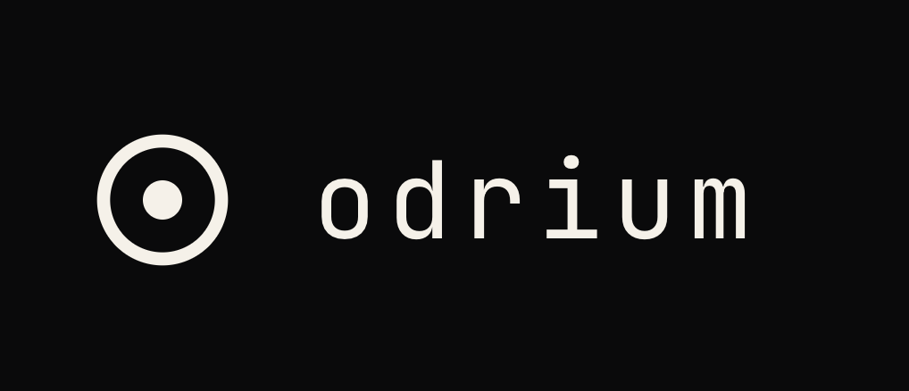

<p align="center">
  
</p>

<p align="center">
  <strong>Self-custody crypto wallet for privacy-conscious users</strong>
</p>

<p align="center">
  <a href="https://odrium.com">Website</a> •
  <a href="#download">Download</a> •
  <a href="#features">Features</a> •
  <a href="#supported-assets">Supported Assets</a> •
  <a href="#security">Security</a>
</p>

<p align="center">
  
  
  
</p>

---

## About

**Odrium** is a desktop cryptocurrency wallet designed with privacy and security as core principles. Built for users who want full control over their digital assets without compromising on usability.

> *A self-custody wallet that can't see you.*

Visit **[odrium.com](https://odrium.com)** for more information.

---

## Download

### macOS (Apple Silicon)

[-000000?style=for-the-badge&logo=apple&logoColor=white)](releases/Odrium_0.1.0_aarch64.dmg)

**File:** `Odrium_0.1.0_aarch64.dmg` (4.4 MB)

### Linux (Debian/Ubuntu)

[-E95420?style=for-the-badge&logo=ubuntu&logoColor=white)](releases/Odrium_0.1.0_amd64.deb)

**File:** `Odrium_0.1.0_amd64.deb` (3.6 MB)

```bash
# Install on Debian/Ubuntu
sudo dpkg -i Odrium_0.1.0_amd64.deb
```

---

## Features

- **True Self-Custody** — Your keys, your coins. No third-party access.
- **Multi-Chain Support** — Manage multiple cryptocurrencies in one secure vault.
- **Cold Storage Ready** — Export encrypted backups to USB for offline storage.
- **Privacy by Design** — No telemetry, no tracking, no data collection.
- **Modern Interface** — Clean, intuitive UI built for everyday use.
- **Cross-Platform** — Available for macOS and Linux.

---

## Supported Assets

| Blockchain | Native Asset | Status |
|------------|--------------|--------|
| Bitcoin | BTC | ✅ Supported |
| Ethereum | ETH | ✅ Supported |
| Solana | SOL | ✅ Supported |
| Monero | XMR | ✅ Supported |
| Zcash | ZEC | ✅ Supported |
| Tron | TRX | ✅ Supported |
| Litecoin | LTC | ✅ Supported |
| Dogecoin | DOGE | ✅ Supported |
| Ripple | XRP | ✅ Supported |

*ERC-20, SPL, and TRC-20 tokens are also supported.*

---

## Security

Odrium implements industry-leading security practices:

- **BIP-39/BIP-32/BIP-44** compliant key derivation
- **Argon2id** for password-based encryption
- **ChaCha20-Poly1305** authenticated encryption
- **Memory zeroization** after sensitive operations
- **No network requests** without explicit user action
- **Open architecture** — verifiable builds coming soon

---

## System Requirements

### macOS
- macOS 11 (Big Sur) or later
- Apple Silicon (M1/M2/M3/M4)
- 100 MB free disk space

### Linux
- Debian 11+ / Ubuntu 20.04+
- x86_64 architecture
- WebKit2GTK 4.1
- 100 MB free disk space

---

## Getting Started

1. Download the installer for your platform
2. Install the application
3. Create a new wallet or import an existing seed phrase
4. Secure your recovery phrase offline
5. Start managing your digital assets

---

## Links

- **Website:** [odrium.com](https://odrium.com)
- **Support:** support@odrium.com

---

<p align="center">
  <sub>Built with security and privacy in mind.</sub>
</p>

<p align="center">
  <sub>© 2026 Odrium. All rights reserved.</sub>
</p>
